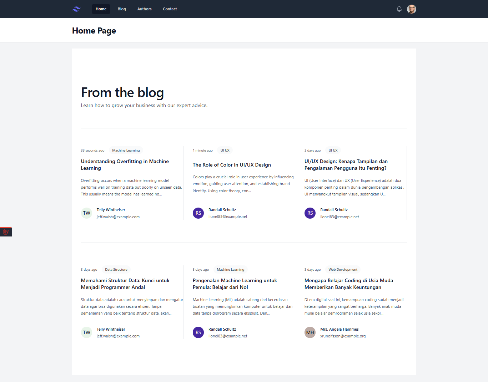

# PJBL 2025 - Laravel Blog App

Project Laravel ini dibuat sebagai bagian dari PJBL kelas 11 semester 2 tahun 2025. Aplikasi ini merupakan blog sederhana dengan fitur CRUD dan filter berdasarkan penulis.

## 🧩 Fitur Utama

- Menampilkan daftar postingan
- CRUD Postingan (Create, Read, Update, Delete)
- Filter berdasarkan author/penulis
- Komponen Blade (navbar, layout)
- Routing dinamis & controller
- Validasi form

## 🛠️ Teknologi yang Digunakan

- Laravel 12
- PHP 8.3+
- Tailwind CSS
- Vite
- MySQL 
- Composer & NPM

## 📷 Tampilan Antarmuka



## ⚙️ Cara Menjalankan Project

```bash
git clone https://github.com/AryaIGG/pjbl-2025.git
cd pjbl-2025

composer install
npm install

cp .env.example .env
php artisan key:generate

php artisan migrate --seed
php artisan serve
